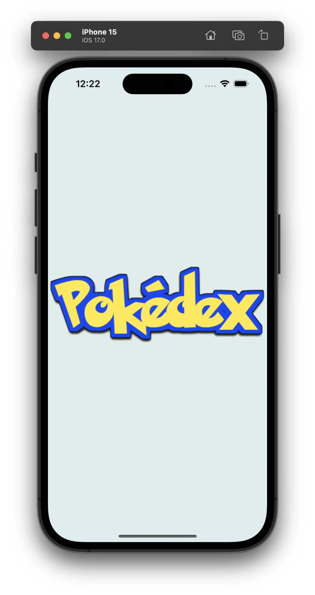

  

# Pokedex

## Overview
Pokedex serves as a comprehensive Pokemon dictionary, capturing data pertaining to various attributes of Pokemon. This application specifically concentrates on the following aspects:

- Name
- Description
- Physical Attributes
- Stats
- Evolution Chain

Pokedex app represents a straightforward yet potent tool for delving into information about diverse Pokemon. It has been meticulously crafted using SwiftUI and adheres to the MVVM (Model-View-ViewModel) architecture pattern, ensuring a distinct separation of concerns and facilitating ease of maintenance.

## App Screens

- **Pokemon List**: Explore the various Pokemon species in list, including paginations, search by name/id, filter features.
- **Pokemon Details**: View detailed information about various Pokemon, including their details, types, abilities, stats and evolution chains.

- **Evolution Chain**: Explore the evolution chain of a Pokemon, including its pre-evolved and evolved forms.

- **Type Details**: Get insights into the specific type details of a Pokemon, such as its strengths and weaknesses.
- **Pokemon Filter**: This screen has done partially.

## Technologies Used

- **SwiftUI**: The user interface is built using SwiftUI, Apple's modern declarative UI framework.

- **MVVM Architecture**: The app follows the MVVM architecture pattern, separating data (Model), UI (View), and logic (ViewModel) for maintainability and testability.

- **Firebase Integration**: The app leverages Firebase for app crashlytics, app analytics, app performance. 

- **SSL Pinning**: To enhance security, the app implements SSL pinning, ensuring that it securely communicates with the backend servers. SSL pinning guards against potential man-in-the-middle attacks.

- **SwiftLint**: The codebase adheres to coding style and best practices enforced by SwiftLint, a static analysis tool for Swift. SwiftLint promotes consistency, identifies potential issues, and enhances code quality through customizable linting rules.

## App Demo

[Full app recording video](https://drive.google.com/file/d/1uvwxSD7uFrA7vr1vESRQHYveaxnsVeWN/view?usp=share_link)

## App Screenshots

<strong>App Logo & Splash Screen</strong>

  
  

<strong>Pokemon List Screens</strong>

  
  

<strong>Search by name/number Screens</strong>

  
  

<strong>Pokemon Detail Screens</strong>

  
  
  

<strong>Filter Screens</strong>

  
  
  
  

